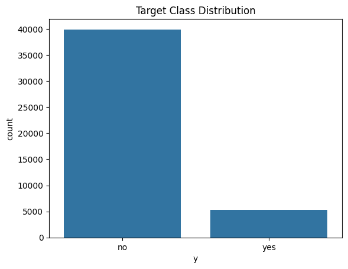
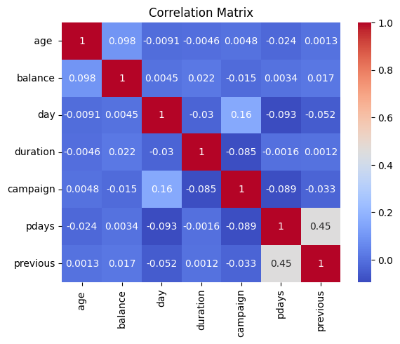
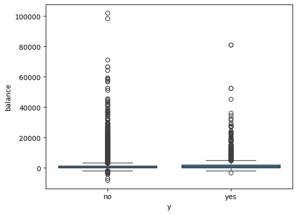
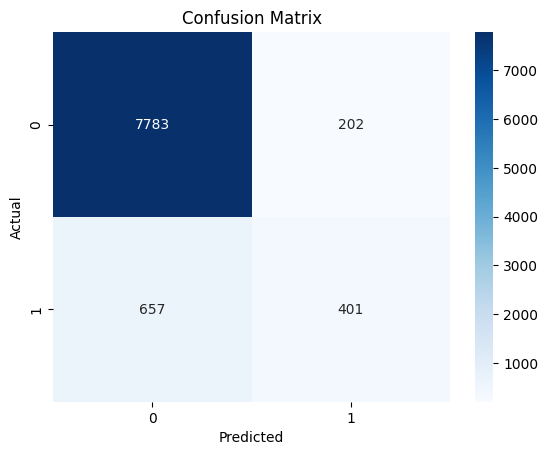

importing libraries


```python
import pandas as pd
import numpy as np
import matplotlib.pyplot as plt
import seaborn as sns
import warnings
warnings.filterwarnings("ignore")

from sklearn.model_selection import train_test_split, cross_val_score
from sklearn.preprocessing import LabelEncoder, StandardScaler
from sklearn.metrics import classification_report, confusion_matrix, accuracy_score
from sklearn.linear_model import LogisticRegression
from sklearn.ensemble import RandomForestClassifier
from xgboost import XGBClassifier

```

Loading Data


```python
file_path = r"C:\Users\User\Downloads\Anaconda\Bank Data\bank-full.csv"
df = pd.read_csv(file_path)
df.head()

```


<div>
<style scoped>
    .dataframe tbody tr th:only-of-type {
        vertical-align: middle;
    }

    .dataframe tbody tr th {
        vertical-align: top;
    }

    .dataframe thead th {
        text-align: right;
    }
</style>
<table border="1" class="dataframe">
  <thead>
    <tr style="text-align: right;">
      <th></th>
      <th>age</th>
      <th>job</th>
      <th>marital</th>
      <th>education</th>
      <th>default</th>
      <th>balance</th>
      <th>housing</th>
      <th>loan</th>
      <th>contact</th>
      <th>day</th>
      <th>month</th>
      <th>duration</th>
      <th>campaign</th>
      <th>pdays</th>
      <th>previous</th>
      <th>poutcome</th>
      <th>y</th>
    </tr>
  </thead>
  <tbody>
    <tr>
      <th>0</th>
      <td>58</td>
      <td>management</td>
      <td>married</td>
      <td>tertiary</td>
      <td>no</td>
      <td>2143</td>
      <td>yes</td>
      <td>no</td>
      <td>unknown</td>
      <td>5</td>
      <td>may</td>
      <td>261</td>
      <td>1</td>
      <td>-1</td>
      <td>0</td>
      <td>unknown</td>
      <td>no</td>
    </tr>
    <tr>
      <th>1</th>
      <td>44</td>
      <td>technician</td>
      <td>single</td>
      <td>secondary</td>
      <td>no</td>
      <td>29</td>
      <td>yes</td>
      <td>no</td>
      <td>unknown</td>
      <td>5</td>
      <td>may</td>
      <td>151</td>
      <td>1</td>
      <td>-1</td>
      <td>0</td>
      <td>unknown</td>
      <td>no</td>
    </tr>
    <tr>
      <th>2</th>
      <td>33</td>
      <td>entrepreneur</td>
      <td>married</td>
      <td>secondary</td>
      <td>no</td>
      <td>2</td>
      <td>yes</td>
      <td>yes</td>
      <td>unknown</td>
      <td>5</td>
      <td>may</td>
      <td>76</td>
      <td>1</td>
      <td>-1</td>
      <td>0</td>
      <td>unknown</td>
      <td>no</td>
    </tr>
    <tr>
      <th>3</th>
      <td>47</td>
      <td>blue-collar</td>
      <td>married</td>
      <td>unknown</td>
      <td>no</td>
      <td>1506</td>
      <td>yes</td>
      <td>no</td>
      <td>unknown</td>
      <td>5</td>
      <td>may</td>
      <td>92</td>
      <td>1</td>
      <td>-1</td>
      <td>0</td>
      <td>unknown</td>
      <td>no</td>
    </tr>
    <tr>
      <th>4</th>
      <td>33</td>
      <td>unknown</td>
      <td>single</td>
      <td>unknown</td>
      <td>no</td>
      <td>1</td>
      <td>no</td>
      <td>no</td>
      <td>unknown</td>
      <td>5</td>
      <td>may</td>
      <td>198</td>
      <td>1</td>
      <td>-1</td>
      <td>0</td>
      <td>unknown</td>
      <td>no</td>
    </tr>
  </tbody>
</table>
</div>


Data Cleaning


```python
# Check for missing values
print(df.isnull().sum())

# Check for unique values and data types
print(df.info())
print(df['y'].value_counts())

```

     age         0
    job          0
    marital      0
    education    0
    default      0
    balance      0
    housing      0
    loan         0
    contact      0
    day          0
    month        0
    duration     0
    campaign     0
    pdays        0
    previous     0
    poutcome     0
    y            0
    dtype: int64
    <class 'pandas.core.frame.DataFrame'>
    RangeIndex: 45211 entries, 0 to 45210
    Data columns (total 17 columns):
     #   Column     Non-Null Count  Dtype 
    ---  ------     --------------  ----- 
     0    age       45211 non-null  int64 
     1   job        45211 non-null  object
     2   marital    45211 non-null  object
     3   education  45211 non-null  object
     4   default    45211 non-null  object
     5   balance    45211 non-null  int64 
     6   housing    45211 non-null  object
     7   loan       45211 non-null  object
     8   contact    45211 non-null  object
     9   day        45211 non-null  int64 
     10  month      45211 non-null  object
     11  duration   45211 non-null  int64 
     12  campaign   45211 non-null  int64 
     13  pdays      45211 non-null  int64 
     14  previous   45211 non-null  int64 
     15  poutcome   45211 non-null  object
     16  y          45211 non-null  object
    dtypes: int64(7), object(10)
    memory usage: 5.9+ MB
    None
    y
    no     39922
    yes     5289
    Name: count, dtype: int64
    

Exploratory Data Analysis (EDA)


```python
# Target distribution
sns.countplot(x='y', data=df)
plt.title("Target Class Distribution")
plt.show()

# Correlation heatmap for numeric features
numeric_features = df.select_dtypes(include=['int64', 'float64']).columns
sns.heatmap(df[numeric_features].corr(), annot=True, cmap='coolwarm')
plt.title("Correlation Matrix")
plt.show()

# Boxplot: balance vs y
sns.boxplot(x='y', y='balance', data=df)
plt.show()

```


    

    


    

    


    

    


Feature Engineering


```python
# Encode binary categorical variables
binary_cols = ['default', 'housing', 'loan', 'y']
for col in binary_cols:
    df[col] = df[col].map({'yes': 1, 'no': 0})

# Encode month as ordinal
month_order = ['jan', 'feb', 'mar', 'apr', 'may', 'jun',
               'jul', 'aug', 'sep', 'oct', 'nov', 'dec']
df['month'] = df['month'].apply(lambda x: month_order.index(x))

# One-hot encode remaining categorical features
categorical_cols = ['job', 'marital', 'education', 'contact', 'poutcome']
df = pd.get_dummies(df, columns=categorical_cols, drop_first=True)

```

Train/Test Split and Scaling


```python
X = df.drop('y', axis=1)
y = df['y']

X_train, X_test, y_train, y_test = train_test_split(
    X, y, test_size=0.2, random_state=42, stratify=y
)

# Scale numeric features
scaler = StandardScaler()
X_train_scaled = scaler.fit_transform(X_train)
X_test_scaled = scaler.transform(X_test)

```


```python
from sklearn.model_selection import GridSearchCV

params = {
    'max_depth': [3, 5, 7],
    'n_estimators': [100, 200],
    'learning_rate': [0.01, 0.1, 0.3]
}

grid = GridSearchCV(XGBClassifier(use_label_encoder=False, eval_metric='logloss'), 
                    param_grid=params, cv=3, scoring='f1')
grid.fit(X_train, y_train)
print("Best Parameters:", grid.best_params_)

```

    Best Parameters: {'learning_rate': 0.1, 'max_depth': 5, 'n_estimators': 200}
    


```python

log_model = LogisticRegression(class_weight='balanced', max_iter=1000)
rf_model = RandomForestClassifier(class_weight='balanced', random_state=42)


from imblearn.over_sampling import SMOTE

smote = SMOTE(random_state=42)
X_train_res, y_train_res = smote.fit_resample(X_train, y_train)

```

Modeling

Logistic Regression


```python
log_model = LogisticRegression(max_iter=1000)
log_model.fit(X_train_scaled, y_train)
log_preds = log_model.predict(X_test_scaled)

print("Logistic Regression:")
print(classification_report(y_test, log_preds))

```

    Logistic Regression:
                  precision    recall  f1-score   support
    
               0       0.91      0.98      0.94      7985
               1       0.64      0.31      0.42      1058
    
        accuracy                           0.90      9043
       macro avg       0.78      0.64      0.68      9043
    weighted avg       0.88      0.90      0.88      9043
    
    

Random Forset


```python
rf_model = RandomForestClassifier(n_estimators=100, random_state=42)
rf_model.fit(X_train, y_train)
rf_preds = rf_model.predict(X_test)

print("Random Forest:")
print(classification_report(y_test, rf_preds))

```

    Random Forest:
                  precision    recall  f1-score   support
    
               0       0.92      0.97      0.95      7985
               1       0.67      0.38      0.48      1058
    
        accuracy                           0.91      9043
       macro avg       0.79      0.68      0.72      9043
    weighted avg       0.89      0.91      0.89      9043
    
    

XGBoost


```python
from imblearn.over_sampling import SMOTE

# Apply SMOTE to training set
smote = SMOTE(random_state=42)
X_train_res, y_train_res = smote.fit_resample(X_train, y_train)

print("Before SMOTE:", y_train.value_counts())
print("After SMOTE:", y_train_res.value_counts())

```

    Before SMOTE: y
    0    31937
    1     4231
    Name: count, dtype: int64
    After SMOTE: y
    0    31937
    1    31937
    Name: count, dtype: int64
    


```python
from xgboost import XGBClassifier
from sklearn.metrics import classification_report

xgb_model_smote = XGBClassifier(use_label_encoder=False, eval_metric='logloss')
xgb_model_smote.fit(X_train_res, y_train_res)

xgb_preds_smote = xgb_model_smote.predict(X_test)

print("XGBoost with SMOTE:")
print(classification_report(y_test, xgb_preds_smote))

```

    XGBoost with SMOTE:
                  precision    recall  f1-score   support
    
               0       0.95      0.93      0.94      7985
               1       0.54      0.59      0.57      1058
    
        accuracy                           0.89      9043
       macro avg       0.74      0.76      0.75      9043
    weighted avg       0.90      0.89      0.90      9043
    
    


```python
from sklearn.model_selection import GridSearchCV

params = {
    'n_estimators': [100, 200],
    'max_depth': [3, 5, 7],
    'learning_rate': [0.01, 0.1, 0.2],
    'subsample': [0.8, 1.0],
    'colsample_bytree': [0.8, 1.0]
}

grid = GridSearchCV(
    estimator=XGBClassifier(use_label_encoder=False, eval_metric='logloss'),
    param_grid=params,
    scoring='f1',
    cv=3,
    verbose=1,
    n_jobs=-1
)

grid.fit(X_train_res, y_train_res)
print("Best parameters found:", grid.best_params_)

```

    Fitting 3 folds for each of 72 candidates, totalling 216 fits
    Best parameters found: {'colsample_bytree': 1.0, 'learning_rate': 0.2, 'max_depth': 7, 'n_estimators': 200, 'subsample': 0.8}
    


```python
xgb_model = XGBClassifier(use_label_encoder=False, eval_metric='logloss')
xgb_model.fit(X_train, y_train)
xgb_preds = xgb_model.predict(X_test)

print("XGBoost:")
print(classification_report(y_test, xgb_preds))

```

    XGBoost:
                  precision    recall  f1-score   support
    
               0       0.93      0.96      0.95      7985
               1       0.63      0.48      0.54      1058
    
        accuracy                           0.91      9043
       macro avg       0.78      0.72      0.74      9043
    weighted avg       0.90      0.91      0.90      9043
    
    

Evaluation & Confusion Matrix


```python
cm = confusion_matrix(y_test, rf_preds)
sns.heatmap(cm, annot=True, fmt='d', cmap='Blues')
plt.xlabel("Predicted")
plt.ylabel("Actual")
plt.title("Confusion Matrix")
plt.show()

```


    

    


```python

```
